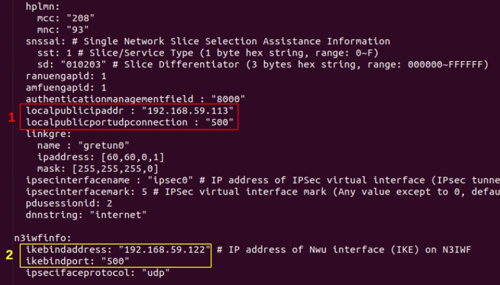
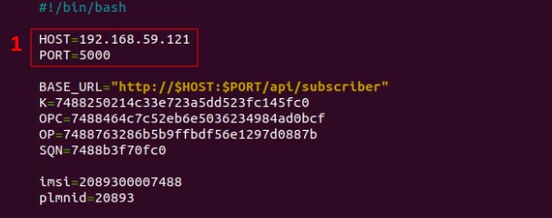

# UE-non3GPP-kotlin
Conversion of the [UE-non3GPP](https://github.com/LABORA-INF-UFG/UE-non3GPP.git) (User Equipment for non-3GPP access via N3IWF V3.1.1) project to the Kotlin programming language.

### Environment
The content described in this repository was tested with the following configurations:
* SO: Ubuntu 20.04 (LTS) x64
* Uname -r: 5.4.0-120-generic
* Memory: 4 GB
* Disk: 80 GB

#### Prerequisites
Execute the following command to install some basic dependencies:
```
sudo apt update && sudo apt -y install git && sudo apt -y install net-tools && sudo apt -y install curl && sudo apt -y install maven
```

### Config UE-non3GPP
Clone the project with the following command:
```
git clone https://github.com/leandro-cassol/UE-non3GPP-kotlin-v1.git
```

Let's assume that there are two other machines configured and already running _free5gc-core_ and _free5gc-n3iwf_. 
After cloning the project, you need to edit the **config.yaml** file to configure the IP addresses of _UE-non3GPP_ and _free5gc-n3iwf_.

```
nano UE-non3GPP-kotlin/UE-Non3gppV1/src/main/kotlin/config/config.yaml 
```
* Replace the 1º marker, illustrated in the following figure in red color, with the IP address and port of the VM where _UE-non3GPP_ will be configured.
* Replace the 2º marker, illustrated in the following figure in yellow color, with the IP address and port of the VM where _free5gc-n3iwf_ is configured.
<p align="center">
     
</p>

### Register UE-non3GPP into Free5GC
You need to edit the **include_ue_non3GPP.sh** file to configure the IP addresses of _free5gc-core_.
```
nano UE-non3GPP-kotlin/UE-Non3gppV1/dev/include_ue_non3GPP.sh
```
* Replace the marker, illustrated in the following figure, with the IP address and port of the VM where _free5gc-core_ is configured.
<p align="center">
     
</p>

Run the UE-non3GPP registration:
```
cd UE-non3GPP-kotlin/UE-Non3gppV1/dev
./include_ue_non3GPP.sh
```

### Compile the project
```
cd UE-non3GPP-kotlin/UE-Non3gppV1
mvn clean compile
```


### Run UE-non3GPP
After adjusting all the configuration parameters, registering the UE in free5GC with the same parameters used in the configuration file and making sure that 5GC and N3IWF are running, execute the following command:

```
cd UE-non3GPP-kotlin/UE-Non3gppV1
mvn exec:java -Dexec.mainClass=cmd.MainKt -Dexec.args="ue"
```
After execution, open another terminal on the same machine and check if a new network interface (eg gretun1) has been created.

### Testing how UE-non3GPP works
To test the operation of UE-non3GPP run the command below:
```
ping -I gretun1 8.8.8.8
```
The above command triggers a connection (ping) to google. If everything is in perfect working order, the terminator must present a positive response to the request. This means that you can direct network traffic to the `gretun1` interface and data network access via 5GC will perform satisfactorily.
